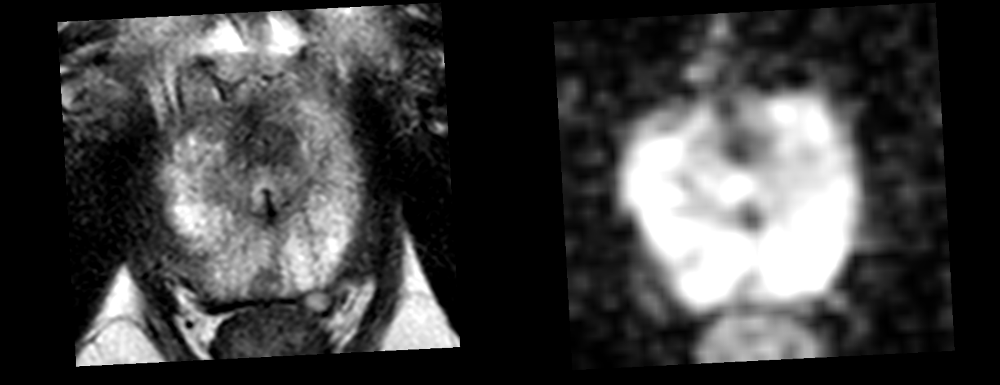

---

---

##### Abstract
This study aimed to develop a noninvasive Machine Learning (ML) model to identify clinically significant prostate cancer (csPCa) according to Gleason Score (GS) based on biparametric MRI (bpMRI) radiomic features and clinical information. Methods: This retrospective study included 86 adult Hispanic men (60 ± 8.2 years, median prostate-specific antigen density (PSA-D) 0.15 ng/mL2) with PCa who underwent prebiopsy 3T MRI followed by targeted MRI–ultrasound fusion and systematic biopsy. Two observers performed 2D segmentation of lesions in T2WI/ADC images. We classified csPCa (GS ≥ 7) vs. non-csPCa (GS = 6). Univariate statistical tests were performed for different parameters, including prostate volume (PV), PSA-D, PI-RADS, and radiomic features. Multivariate models were built using the automatic feature selection algorithm Recursive Feature Elimination (RFE) and different classifiers. A stratified split separated the train/test (80%) and validation (20%) sets. Results: Radiomic features derived from T2WI/ADC are associated with GS in patients with PCa. The best model found was multivariate, including image (T2WI/ADC) and clinical (PV and PSA-D) information. The validation area under the curve (AUC) was 0.80 for differentiating csPCa from non-csPCa, exhibiting better performance than PI-RADS (AUC: 0.71) and PSA-D (AUC: 0.78). Conclusion: Our multivariate ML model outperforms PI-RADS v2.1 and established clinical indicators like PSA-D in classifying csPCa accurately. This underscores MRI-derived radiomics’ (T2WI/ADC) potential as a robust biomarker for assessing PCa aggressiveness in Hispanic patients.

---



---

##### Citation

Dominguez, I., Rios-Ibacache, O., Caprile, P., Gonzalez, J., San Francisco, I. F., & Besa, C. (2023). MRI-Based Surrogate Imaging Markers of Aggressiveness in Prostate Cancer: Development of a Machine Learning Model Based on Radiomic Features. Diagnostics, 13(17), 2779. https://doi.org/10.3390/diagnostics13172779

```BibTeX
@Article{diagnostics13172779,
AUTHOR = {Dominguez, Ignacio and Rios-Ibacache, Odette and Caprile, Paola and Gonzalez, Jose and San Francisco, Ignacio F. and Besa, Cecilia},
TITLE = {MRI-Based Surrogate Imaging Markers of Aggressiveness in Prostate Cancer: Development of a Machine Learning Model Based on Radiomic Features},
JOURNAL = {Diagnostics},
VOLUME = {13},
YEAR = {2023},
NUMBER = {17},
ARTICLE-NUMBER = {2779},
URL = {https://www.mdpi.com/2075-4418/13/17/2779},
PubMedID = {37685317},
ISSN = {2075-4418},
ABSTRACT = {This study aimed to develop a noninvasive Machine Learning (ML) model to identify clinically significant prostate cancer (csPCa) according to Gleason Score (GS) based on biparametric MRI (bpMRI) radiomic features and clinical information. Methods: This retrospective study included 86 adult Hispanic men (60 ± 8.2 years, median prostate-specific antigen density (PSA-D) 0.15 ng/mL2) with PCa who underwent prebiopsy 3T MRI followed by targeted MRI–ultrasound fusion and systematic biopsy. Two observers performed 2D segmentation of lesions in T2WI/ADC images. We classified csPCa (GS ≥ 7) vs. non-csPCa (GS = 6). Univariate statistical tests were performed for different parameters, including prostate volume (PV), PSA-D, PI-RADS, and radiomic features. Multivariate models were built using the automatic feature selection algorithm Recursive Feature Elimination (RFE) and different classifiers. A stratified split separated the train/test (80%) and validation (20%) sets. Results: Radiomic features derived from T2WI/ADC are associated with GS in patients with PCa. The best model found was multivariate, including image (T2WI/ADC) and clinical (PV and PSA-D) information. The validation area under the curve (AUC) was 0.80 for differentiating csPCa from non-csPCa, exhibiting better performance than PI-RADS (AUC: 0.71) and PSA-D (AUC: 0.78). Conclusion: Our multivariate ML model outperforms PI-RADS v2.1 and established clinical indicators like PSA-D in classifying csPCa accurately. This underscores MRI-derived radiomics’ (T2WI/ADC) potential as a robust biomarker for assessing PCa aggressiveness in Hispanic patients.},
DOI = {10.3390/diagnostics13172779}
}
```

---

##### Related material

+ [PizzaSeminar presentation slides at Pontificia Universidad Catolica de Chile, Faculty of Physics](PizzaSeminar.pdf)
